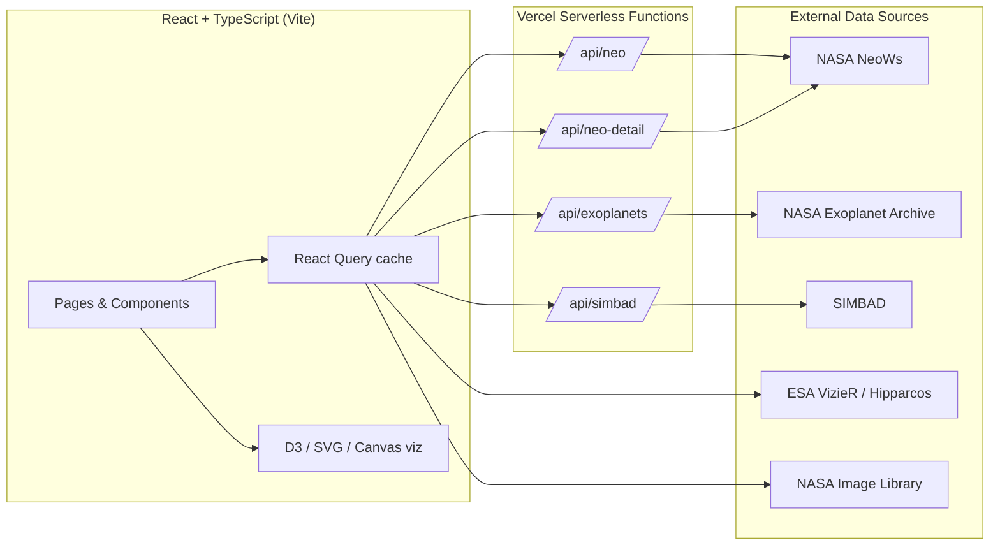

# 🌌 Cosmos Explorer

An interactive web platform for exploring real-time cosmic data — near-Earth asteroids, the solar system, stars, exoplanets, and deep-sky objects — built on live feeds from five professional astronomy data sources.

**Live demo:** [cosmos-explorer-kappa.vercel.app](https://cosmos-explorer-kappa.vercel.app)

## Overview

Cosmos Explorer pulls data from NASA and ESA APIs and renders it through interactive visualizations built with D3 and SVG. It is a single-page React application with a small set of serverless proxy functions that keep API keys server-side and resolve cross-origin restrictions.

The project began as a study in turning raw astronomical catalog data into something explorable in the browser, with an emphasis on honest data handling: where real measurements exist they are shown; where they do not, the interface says so rather than inventing them.

---

## Features

### Near-Earth Objects & Solar System
- Animated heliocentric map of the solar system rendered from Keplerian orbital elements.
- All eight planets and selected comets (1P/Halley, 2P/Encke), positioned at their true locations for any date using a Newton–Raphson solution to Kepler's equation.
- Live near-Earth asteroid feed from NASA's NeoWs API, with potentially-hazardous objects flagged.
- Time controls: play/pause animation and a date scrubber that advances every body along its orbit at its real relative speed.
- Multiple zoom levels, from the inner asteroid region out to Neptune and the comet orbits.
- Hover any body to highlight its orbit and read its parameters.

### Star Catalog
- Cone-search against the Hipparcos catalog via ESA/VizieR.
- Canvas-rendered star field with B–V color-index mapping and magnitude-scaled sizing.
- Magnitude-distribution histogram (D3).
- Presets for well-known regions (Orion, Pleiades, Galactic Center, Andromeda).

### Exoplanets
- 4,700+ confirmed planets from the NASA Exoplanet Archive.
- Habitable-zone estimation and host-star context.

### Deep-Sky Objects
- Curated catalog of famous objects (Messier and NGC) resolved through SIMBAD.
- Accurate imagery from the NASA Image and Video Library, with an honest fallback message when no verified image exists for an object.

---

## Architecture



The serverless proxies exist for two reasons: to keep the NASA API key out of the client, and to add a server-side caching/CORS layer in front of upstream APIs that don't send permissive CORS headers. VizieR and the NASA Image Library are called directly from the client where CORS allows it.

---

## Tech Stack

| Layer | Choice |
|---|---|
| Framework | React 18 + TypeScript |
| Build tool | Vite |
| Data fetching | TanStack React Query |
| Visualization | D3.js, SVG, Canvas |
| Routing | React Router |
| Backend | Vercel serverless functions |
| Testing | Vitest + Testing Library |
| Hosting | Vercel |

---

## Getting Started

### Prerequisites
- Node.js 18+
- A free NASA API key from [api.nasa.gov](https://api.nasa.gov) (optional for local dev; the demo key works but is heavily rate-limited)

### Setup

```bash
git clone https://github.com/Jeanm2005/cosmos-explorer.git
cd cosmos-explorer
npm install
```

Create a `.env.local` file in the project root:

```
NASA_API_KEY=your_key_here
VITE_NASA_API_KEY=your_key_here
```

Both names point to the same key. `NASA_API_KEY` is read by the serverless proxies; `VITE_NASA_API_KEY` is exposed to the frontend during local development (Vite only exposes variables prefixed with `VITE_`).

### Running locally

```bash
# Frontend only (NEO, stars, and direct-CORS features work)
npm run dev

# Full stack including the serverless proxies (exoplanets, SIMBAD)
vercel dev
```

The proxy-backed features (exoplanets, deep-sky objects) require `vercel dev` so the `/api` functions run. Plain `npm run dev` serves the frontend alone.

### Other scripts

```bash
npm run build        # production build
npm run test         # run unit tests
npm run type-check   # TypeScript check, no emit
```

---

## Implementation Notes

A few decisions worth calling out:

**Orbital mechanics.** Positions are computed from classical Keplerian elements (J2000 epoch). Kepler's equation `M = E − e·sin(E)` is solved numerically with Newton–Raphson iteration; the result is projected to the ecliptic plane for the 2D map. Planet and comet elements are well-known constants, so these render without any network dependency.

**Asteroid data.** NASA's NeoWs feed endpoint returns close-approach data but not full orbital elements, which are only available per-object from a detail endpoint. The app fetches those for a capped, rate-limit-aware set; objects whose detail lookup fails fall back to a deterministic placeholder orbit derived from the object's ID, so they scatter plausibly across the map rather than stacking on a single point. Real elements are used wherever available.

**Honest imagery.** The deep-sky view only shows an image when a verified NASA Image Library match exists for the object. Where none is found, it says so explicitly instead of substituting an unrelated or unverifiable image.

---

## Roadmap

- Computational-physics simulations (n-body, relativistic effects) as a separate, more compute-intensive companion project.
- Asteroid-belt visualization.
- Richer per-object detail (spectral data for stars, atmospheric data for exoplanets).

---

## License

Released under the MIT License — see [`LICENSE`](LICENSE).

## Acknowledgments

Data courtesy of NASA (NeoWs, Exoplanet Archive, Image and Video Library), the CDS (SIMBAD, VizieR), and the ESA Hipparcos mission.